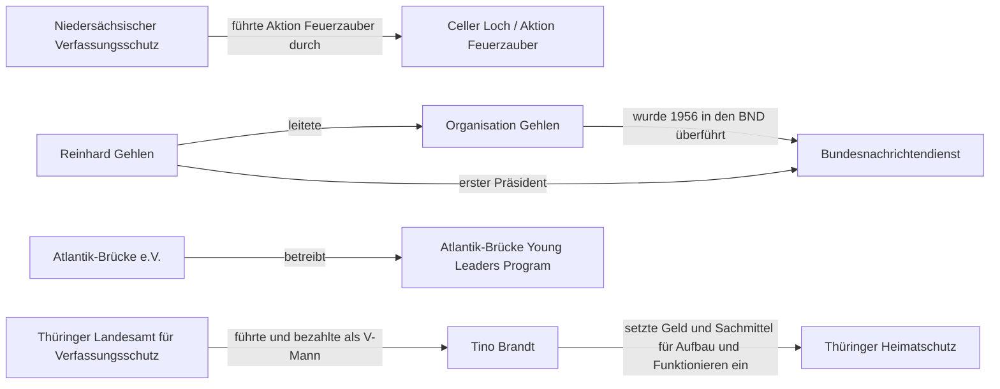

# Netzwerk

_Automatisch aus data/relations.yml erzeugt. Jede Kante besitzt mindestens eine Quelle._

## Relationen

| ID | Von | Beziehung | Zu | Evidenz | Quellen |
|---|---|---|---|---|---|
| REL-DE-CELLER-001 | Niedersächsischer Verfassungsschutz | führte Aktion Feuerzauber durch | Celler Loch / Aktion Feuerzauber | established | SRC-DE-NI-MJ-CELLER-2015 |
| REL-DE-GEHLEN-001 | Organisation Gehlen | wurde 1956 in den BND überführt | Bundesnachrichtendienst | established | SRC-DE-BPB-BND-2026 |
| REL-DE-GEHLEN-002 | Reinhard Gehlen | leitete | Organisation Gehlen | established | SRC-DE-BPB-BND-2026 |
| REL-DE-GEHLEN-003 | Reinhard Gehlen | erster Präsident | Bundesnachrichtendienst | established | SRC-DE-BPB-BND-2026 |
| REL-DE-THS-001 | Thüringer Landesamt für Verfassungsschutz | führte und bezahlte als V-Mann | Tino Brandt | established | SRC-DE-THLT-NSU-UA-2014 |
| REL-DE-THS-002 | Tino Brandt | setzte Geld und Sachmittel für Aufbau und Funktionieren ein | Thüringer Heimatschutz | established | SRC-DE-THLT-NSU-UA-2014 |
| REL-DE-AB-001 | Atlantik-Brücke e.V. | betreibt | Atlantik-Brücke Young Leaders Program | established | SRC-DE-ATLANTIKBRUECKE-YL |
